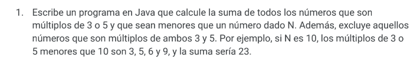
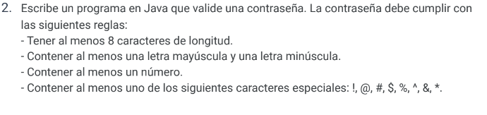
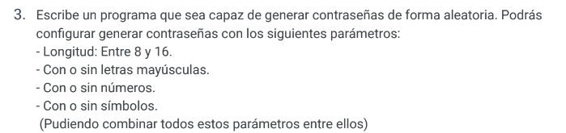
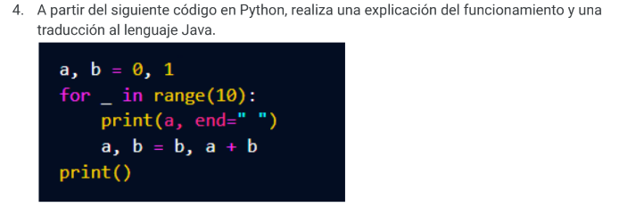

# RETO 11/12/2023

Se realiza el reto del dia 11 el cual consta de cuatro puntos.

Estos ejercicios se realizaron en JAVA.

# Como descargar el proyecto 

Se descarga el archivo completo con el pom.xml para que se pueda realizar la compilacion , es preferible hacer la compilacion en NETBEANS . 